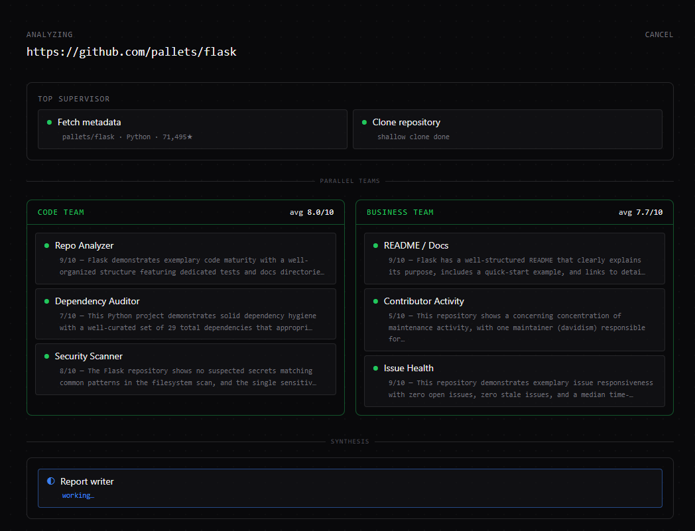
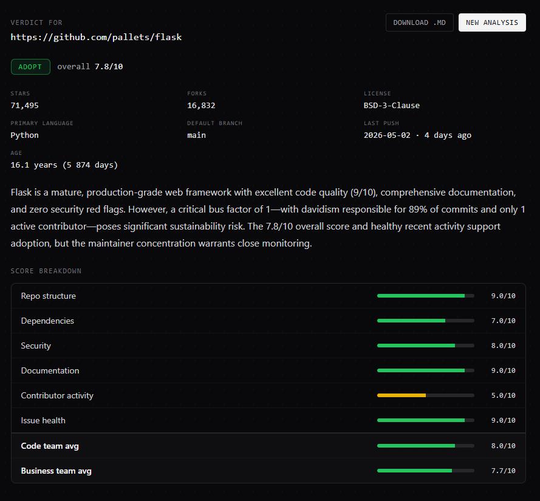
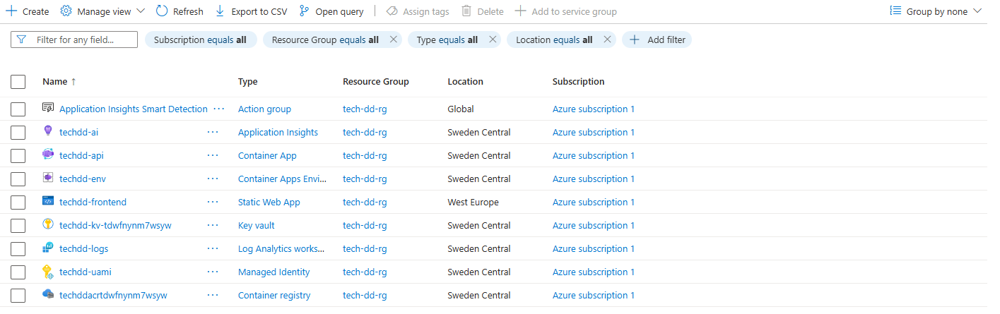

# Tech Due Diligence Team

A hierarchical multi-agent system that takes a public GitHub repository URL
and produces a structured adoption verdict — **ADOPT** / **ADOPT WITH CAUTION** /
**AVOID** — with concrete, data-grounded strengths and risks.

## Demo



*Top supervisor delegates to two specialized teams running in parallel.
Each team coordinates three specialists; results are synthesized into a final report.*



*Final verdict with score breakdown across six dimensions, color-coded for instant scanability.*

Built with [LangGraph](https://github.com/langchain-ai/langgraph), Anthropic
Claude (Haiku 4.5), FastAPI + SSE for streaming, and a React/Vite/Tailwind
front end.

```
                       ┌─────────────────┐
                       │ Top Supervisor  │
                       └────────┬────────┘
                                │
              ┌─────────────────┴────────────────┐
              ▼                                  ▼
       ┌─────────────┐                   ┌─────────────────┐
       │  Code Team  │                   │ Business Team   │
       └──────┬──────┘                   └────────┬────────┘
              │                                   │
   ┌──────────┼──────────┐             ┌──────────┼─────────┐
   ▼          ▼          ▼             ▼          ▼         ▼
 Repo     Dependency  Security     README    Contributor  Issue
Analyzer   Auditor    Scanner     Analyzer    Activity   Health
              │                                   │
              └─────────────────┬─────────────────┘
                                │
                       ┌────────▼────────┐
                       │ Report Writer   │
                       └─────────────────┘
```

Each specialist runs deterministic data collection, then a single LLM call
emits a `summary + score 1-10`. A team-level compiler aggregates the three
specialist scores. The Report Writer takes both team reports plus repo
metadata and produces the final markdown report (executive summary,
strengths, risks, score table, detailed findings).

Runs end-to-end in ~25s for ~$0.015 (8 LLM calls on Claude Haiku 4.5).

## Calibration policies

Two policies wrap the LLM verdict to keep it from being lulled by averages:

- **Veto.** Any single dimension scored `<=2` forces `AVOID`; `<=3` caps the
  verdict at `ADOPT WITH CAUTION`. Strong scores in other dimensions don't
  compensate. Capped server-side regardless of LLM output.
- **Young project.** When the repo is `<180` days old, maturity signals (CI,
  dev deps, contributor diversity, PR throughput) are weighted lower in the
  verdict prompt — they're naturally weak this early. A `Young Project`
  banner is rendered alongside the report.

## Validated on

| Repo | Profile | Verdict | Notes |
|---|---|---|---|
| `pallets/flask` | healthy mature | ADOPT (7.8) | Bus factor 1 (davidism 89%) flagged as risk |
| `requests/requests-oauthlib` | abandoned | AVOID (6.0) | Veto on Issue health 2/10 (102 stale issues) |
| `tiangolo/fastapi` | single-maintainer | ADOPT (8.2) | Multiple active contributors, fast triage |
| `karpathy/autoresearch` | young trending | CAUTION (5.2) | Young Project softens AVOID to CAUTION |

## Stack

**Backend** — Python 3.11+
- `langgraph` — graph orchestration
- `langchain-anthropic` — Claude API
- `requests` + `diskcache` — GitHub API client with 1h cache
- `fastapi` + `uvicorn` — HTTP API + Server-Sent Events
- `pydantic` — structured LLM output validation

**Frontend** — TypeScript
- `vite` + `react` 18
- `tailwindcss` + `@tailwindcss/typography`
- `react-markdown` + `remark-gfm`
- Native `EventSource` for SSE consumption

## Setup

Requires Python 3.11+, Node 18+, and `git` on PATH (for cloning analyzed
repos).

```sh
# Backend
python -m venv venv
venv\Scripts\activate          # Windows
# source venv/bin/activate     # macOS / Linux
pip install -e .

# Secrets
cp .env.example .env
# fill in ANTHROPIC_API_KEY and GITHUB_TOKEN

# Frontend
cd frontend
npm install
```

## Running

```sh
# Terminal 1 — backend
venv\Scripts\python.exe -m uvicorn backend.api:app --reload

# Terminal 2 — frontend
cd frontend
npm run dev
```

Open http://localhost:5173 and submit a GitHub repo URL. Vite proxies
`/analyze*` to the backend at `127.0.0.1:8000`.

## CLI usage (no UI)

```sh
venv\Scripts\python.exe run.py https://github.com/pallets/flask
```

Streams node-by-node updates and prints the final markdown report. Reports
are also written to `reports/` when running `scripts/validate.py`.

## Project structure

```
.
├── backend/
│   └── api.py                 # FastAPI: POST /analyze, GET stream, GET final
├── src/
│   ├── graph.py               # Top-level StateGraph (fetch → clone → teams → report → cleanup)
│   ├── state.py               # TypedDicts for top + sub-team states
│   ├── llm.py                 # Shared ChatAnthropic factory + token/cost tracking
│   ├── report_writer.py       # Final synthesis: LLM + deterministic veto/age formatting
│   ├── teams/
│   │   ├── code_team.py       # Subgraph: repo / deps / security
│   │   └── business_team.py   # Subgraph: readme / contributors / issues
│   ├── agents/
│   │   ├── repo_analyzer.py
│   │   ├── dependency_auditor.py
│   │   ├── security_scanner.py
│   │   ├── readme_analyzer.py
│   │   ├── contributor_activity.py
│   │   └── issue_health.py
│   └── tools/
│       ├── github.py          # Cached, rate-limit-aware GitHub REST client
│       ├── repo.py            # Shallow git clone + Windows-safe cleanup
│       └── filesystem.py      # walk / glob / count_lines / find_first
├── frontend/
│   └── src/
│       ├── App.tsx
│       ├── hooks/useAnalysis.ts   # POST + EventSource + useReducer state
│       ├── types/events.ts        # SSE event union, topology constants
│       ├── components/
│       │   ├── InputScreen.tsx
│       │   ├── ProgressView.tsx   # Hierarchical agent visualization
│       │   ├── TeamColumn.tsx
│       │   ├── AgentCard.tsx
│       │   ├── ReportView.tsx     # Markdown + structured overlays
│       │   ├── ScoreBar.tsx       # Color-coded bar (green ≥7 / yellow 4-6 / red ≤3)
│       │   ├── ScoreTable.tsx
│       │   ├── VetoCallout.tsx
│       │   ├── MetaGrid.tsx       # + YoungBanner
│       │   └── RecommendationBadge.tsx
│       └── utils/format.ts
├── scripts/
│   ├── smoke_github.py            # GitHub client smoke test
│   ├── smoke_filesystem.py        # filesystem helpers
│   ├── test_repo_analyzer.py      # standalone agent tests
│   ├── test_dependency_auditor.py
│   ├── test_security_scanner.py
│   ├── test_code_team.py          # subgraph tests
│   ├── test_business_team.py
│   ├── test_api.py                # backend E2E (POST + SSE + GET)
│   └── validate.py                # 4-repo regression harness
├── reports/                       # markdown reports from validate.py
├── run.py                         # CLI entrypoint
├── pyproject.toml
├── .env.example
└── .gitignore
```

## SSE event schema

The streaming endpoint emits one JSON event per `data:` line:

```ts
type AgentEvent =
  | { type: "node_start"; node: string; team?: "code" | "business" }
  | { type: "node_complete"; node: string; team?: "code" | "business"; summary: string }
  | { type: "team_complete"; team: "code" | "business"; scores: Record<string, number>; overall_score: number }
  | { type: "report_ready"; report: { recommendation, report_markdown, overall_score, veto } }
  | { type: "complete"; usage: { calls, input_tokens, output_tokens, cost_usd } }
  | { type: "error"; message: string }
```

## Known limitations

- **In-memory store.** Restarting the backend wipes pending analyses; refreshing
  the frontend forgets the `analysis_id`. Fix: add LangGraph `SqliteSaver`
  checkpointing keyed by `analysis_id`.
- **Sequential team execution.** Code team runs to completion before Business
  team starts. The UI is laid out for parallel teams; flipping to LangGraph's
  `Send` API would parallelize without touching the front end.
- **Shallow clone.** `git clone --depth 1` means we scan only `HEAD`, not
  history — secrets in old commits won't be found. Acceptable trade-off; full
  history scan would multiply clone time.
- **Issue sample bias.** Repos with thousands of open issues are sampled to
  the first 300 by `created` desc; stale-count is approximate.
- **OSV vulnerability lookup** is not yet wired into the dependency auditor.
- **No automated tests** beyond the smoke / standalone scripts under `scripts/`.

## Cost & token usage

Per analysis (Claude Haiku 4.5):

| Item | Approx |
|---|---|
| LLM calls | 7-8 (6 specialists + 1 report writer, occasionally retries) |
| Input tokens | ~10k |
| Output tokens | ~1.5k |
| Total cost | ~$0.015 |
| Wall time | ~25 seconds |

Switch to Sonnet by passing `model="claude-sonnet-4-6"` to `get_llm()` in any
agent — slower and ~3x cost, useful when validating prompt changes.

## Deployment

Deployed to Azure as Bicep IaC, with three GitHub Actions pipelines:

- **Backend** — FastAPI on Container Apps. Image pulled from ACR and secrets (Anthropic + GitHub tokens) read from Key Vault, both via a user-assigned managed identity — no keys in env vars. Application Insights wired for traces.
- **Frontend** — Vite build on Static Web Apps, `VITE_API_BASE` injected at build time.
- **CI/CD** — `backend/**` rebuilds the image and rolls the Container App, `frontend/**` redeploys the SWA, `infra/**` runs `az deployment group create`. All infrastructure lives in `infra/main.bicep`.



Infra is currently torn down to free credits and avoid token costs from the public analyze endpoint. Redeploy via `az group create` + the `infra/**` pipeline, then the `backend/**` pipeline to build and ship the image.

